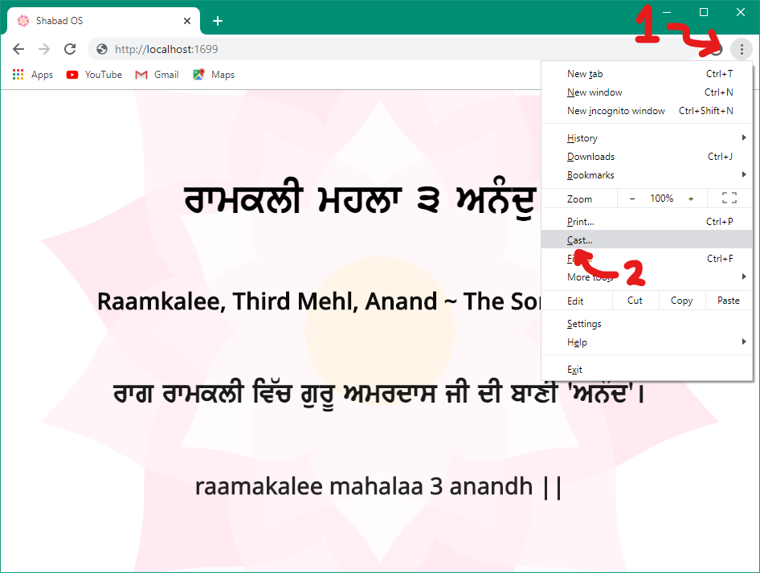
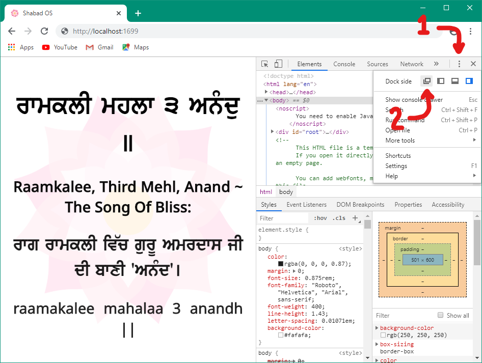

This tutorial is for users that would like to cast the Shabad OS display to a chromecast. This tutorial will show how to display Shabad OS on devices (e.g. TVs, projectors, and monitors) with chromecast.

## Concept

Most of Shabad OS's features are available as websites with different URLs. The Google Chrome browser allows webpages to be cast to any Chromecast on the network. This lets users open the Shabad OS display in Google Chrome and cast it to a Chromecast wirelessly.

## Practical

### Casting with Google Chrome

Open Google Chrome and enter the display URL of Shabad OS into the address bar. If the same device is running Shabad OS and will be used to cast, then simply use `http://localhost:1699` (see [URL Endpoints](./url-endpoints.md) for more flexible arrangements across other devices).

Once the page is loaded on Google Chrome, you may cast to a device using ⋮ (menu button / 3 vertical dots) > Cast. In the Cast Tab menu simply choose the chromecast device you'd like to display the Shabad OS presentation on.

:::note
The ratio and resolution of the Google Chrome tab's window will be used on the Chromecasted device.
:::

:::note
Make sure you're casting the Google Chrome tab by clicking the "Sources" button at the bottom of the Cast Tab menu.
:::

If both the device that is casting and the device that is being casted to share the same resolution or similar ratios, then simply full screen the Google Chrome browser tab by selecting ⋮ (Menu) > ⛶ (Fullscreen) or by hitting F11 on your keyboard.

### Advanced Sizing

If the device that is casting is 16:9 (e.g. 1920x1080) but, for example, the projector being casted to is 4:3 (e.g. 1280x1024), then you will cast with black bars above and below the presentation tab.

To change the size of the tab being casted, simply open developer tools and resize the window. Doing so will show the size of the webpage being casted in the upper right corner.

image::google-chrome-resizing-info.png[Resizing the Google Chrome tab,500]

To open developer tools, select ⋮ (Menu) > More tools > Developer tools. By default this opens as a docked window, which may be awkward when resizing the tab. Simply undock it from the developer tool's main menu (⋮) by selecting the first icon in the "Dock side" section. See [Chrome Devtools Docs](https://developers.google.com/web/tools/chrome-devtools/customize/placement) for more info.

Once undocked, you may minimize the dev tools and simply resize the Google Chrome browser window to affect the size and ratio of the chromecasted Shabad OS tab.
