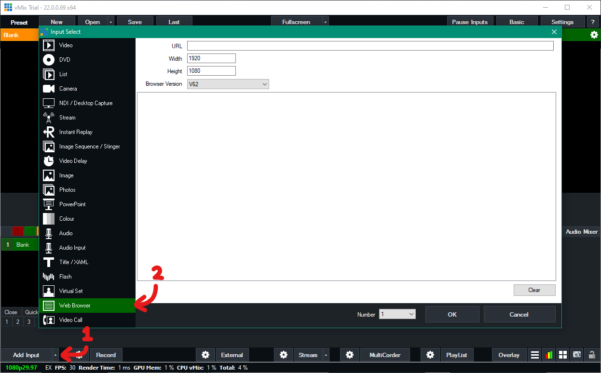

This tutorial is for users wishing to integrate Shabad OS captions with their live stream software. This tutorial shows how to add a browser to popular live streaming applications.

## Concept

Shabad OS provides an Overlay URL which displays parts of the currently activated line. To show this on a livestream, one has to add a browser element to the livestream program/software and point it to the aforementioned URL. For more information on setting up the Overlay, please see how to [Get started with Overlays](./get-started.md). This tutorial will show how to integrate the Shabad OS Overlay with popular livestream softwares.

## Practical

### Step 1: Find the Overlay URL for Shabad OS

Copying this should be as easy as clicking the Overlay URL in _Shabad OS > Settings > Overlay_. If there is no URL there, please read [URL Endpoints](./../url-endpoints.md).

Find the Overlay URL in Settings

### Step 2: Configure the Livestream Software

Add a browser, point it to the Overlay URL, and size it to match the live stream resolution.

:::tip
For clear and crisp fonts, match the browser size to the resolution of the live stream. Avoid zooming or resizing the browser element to incorrect proportions.
:::

:::note
Any software which allows adding a browser URL will work. Popular applications like [OBS Studio](https://obsproject.com/), [vMix](https://www.vmix.com/), and [Wirecast](https://www.telestream.net/wirecast/overview.htm) can work. See [Examples](#examples) below.
:::

## Examples

:::note List of Examples

- [OBS Studio](#obs-studio)
- [vMix](#vmix)
- [Wirecast](#wirecast)

:::

### OBS Studio

1. Add a browser to OBS Studio's scene by clicking the "+" button in _Sources_. For ease of use we recommend naming this source "Shabad OS Captions" instead of simply "Browser".
2. Focus on the _URL_, _Width_, _Height_, and _Custom CSS_ fields.

   1. _URL_ should be the URL from [Step 1](#step-1-find-the-overlay-url-for-shabad-os).
   2. _Width_ and _Height_ should match the Base Canvas Resolution found in _Settings > Video_ (e.g. 1920x1080 would mean 1920 for the width and 1080 for the height).
   3. _Custom CSS_ should be empty.
      
      Adding a browser source to OBS Studio

### vMix

1. Add a web browser input to vMix's mixer by clicking _Add Input > More > Web Browser_.
2. Focus on the _URL_, _Width_, and _Height_ fields.
   1. _URL_ should be the URL from [Step 1](#step-1-find-the-overlay-url-for-shabad-os).
   2. _Width_ and _Height_ should match the Output Size found in _Settings > Display_ (e.g. 1920x1080 would mean 1920 for the width and 1080 for the height).
      
      Adding a browser source to vMix

### Wirecast

1. Add a web page shot layer to Wirecast's master layer. There may be a prompt to install Flash, which can be ignored as Shabad OS does not require it.
   
   Adding a web page shot layer to Wirecast

2. Set the name to something familiar (e.g. "Shabad OS Overlay").

3. Focus on the _Address_, _Video Width_, and _Video Height_ fields.

   1. _Address_ should be the URL from [Step 1](#step-1-find-the-overlay-url-for-shabad-os).
   2. _Video Width_ and _Video Height_ should match the Canvas Size found in _Output > Canvas Size_ (e.g. "Auto (1280x720)" would mean 1280 for the width and 720 for the height).
      
      Configuring the Source Properties in Wirecast

4. Set scale of the shot layer to 100%.
   
   100% Scale used for the Shot Layer Properties in Wirecast
