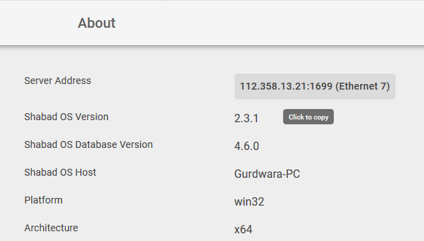
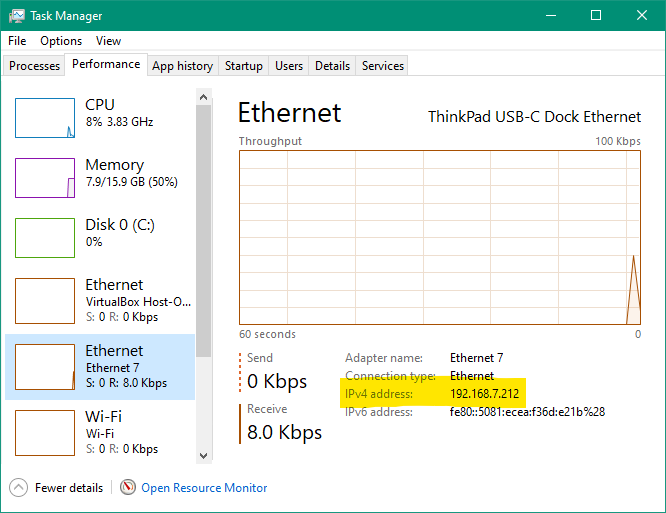

This tutorial is for users wishing to know about Shabad OS being accessed through a web browser. This tutorial will show which pages are available as well as how to find the correct address to use in most modern web browsers.

## Concept

Most of Shabad OS is actually a website with different URLs. The presenter/display, controller, overlay, and settings/configuration are all accessible by most modern web browsers. This lets users connect to Shabad OS from other devices like another laptop or smartphone. For example, it allows users to control projectors in a gurdwara with their smartphone. For another example, it allows users to use Shabad OS on one device and livestream the captions with a different computer.

## Practical

### URL of the Host Device

The device running Shabad OS has an IP address. In production, Shabad OS is available from port 1699 of this IP address. This combination of IP address and port can be used in most web browsers.

If the same device is running Shabad OS, you may simply use `localhost` or `127.0.0.1` for the IP address (i.e. with port: `http://localhost:1699/` or `http://127.0.0.1:1699/`). If this is the case, you do not need to find the device's IP address on the network.

Otherwise, if you'd like to connect through the same network to Shabad OS being used on a different device, you may find the IP address of that device from _Shabad OS > Settings > About_ or _Shabad OS > Settings > Overlay_.

Find the IP Address in Shabad OS

:::tip
Windows 10 users can view the _Task Manager_ (either right click the taskbar or use the hotkey ctrl+shift+esc) to find the IP address. Use the _Performance_ tab and select the Ethernet/Wi-Fi being used to connect to the network in the Task Manager.

Finding the IP Address on Windows 10
:::

:::tip
macOS users can view _System Preferences > Network_ (found from the apple icon in the menubar). Then select the Ethernet/Wi-Fi being used to connect to the network.
:::

### Table of Endpoints

A breakdown of the terminology used for Shabad OS URLs tends to follow the pattern: `http:// [IP ADDRESS] : [PORT] / [ENDPOINT]`. In production, Shabad OS uses the port 1699 for stable and beta releases. For instance the base url (empty endpoint) could be `http://localhost:1699/` and the overlay url (overlay endpoint) could be `http://localhost:1699/overlay`. Users can test these endpoints, on the same machine running Shabad OS, with a web browser like Google Chrome or Mozilla Firefox.

### Shabad OS URL Endpoints

| Endpoint                               | Description                                                                                                                                                                                 |
| -------------------------------------- | ------------------------------------------------------------------------------------------------------------------------------------------------------------------------------------------- |
| /                                      | The empty endpoint points to the default Shabad OS Presenter page (Users can get a controller from this page using the plus sign in the bottom right and then fullscreening the controller) |
| /controller/search?controllerOnly=true | A fullscreened controller in the search activity                                                                                                                                            |
| /overlay                               | HTML file showing all relevant fields of currently activated line. Can be styled/customized by CSS. See xref:overlay:overlay.adoc[Overlay] for an outline.                                  |

## Example

For example, if the device running Shabad OS has an IP address of `192.168.0.128`, then the url for the overlay endpoint would be `http://192.168.0.128:1699/overlay`. This could be used in a browser by any device on the same network. For example, allowing you to use Shabad OS from one device and livestream software from a second device. (Again, if the livestream software and Shabad OS were both running on the same device, you could have simply used `http://localhost:1699/overlay` as the URL).
